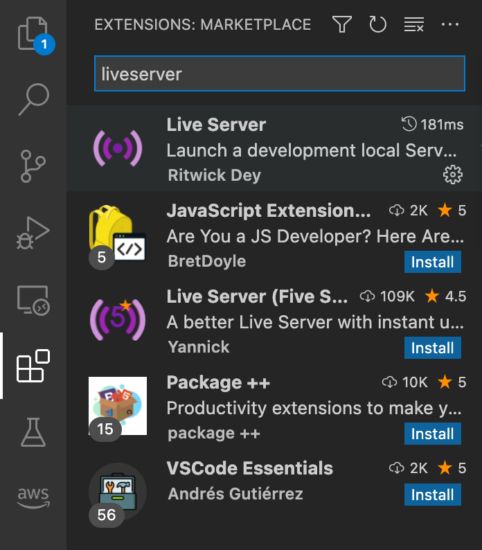
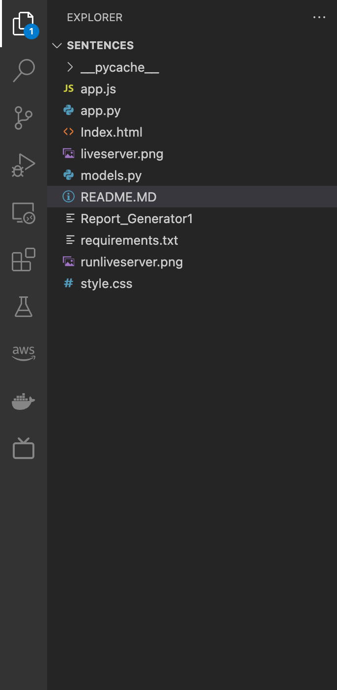
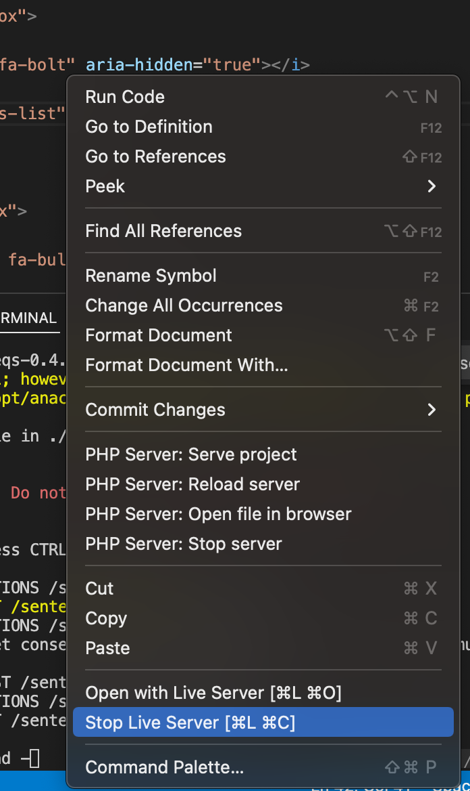
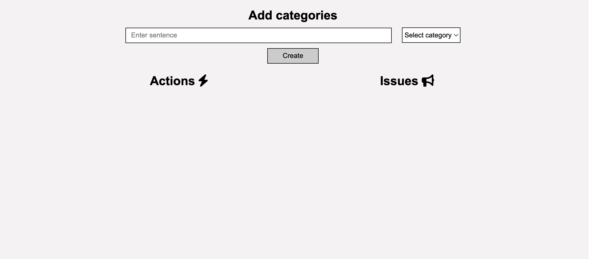

## Installation

### download and install vscode
   VSCode is a free and open source text editor and we need it to act as a webserver.
  [Download VSCode](https://code.visualstudio.com/download)
 * once vscode is installed we'll need to add the extension called liveserve
 * 


### Make sure python is installed on you machine
If not instaled Download and install python from [here](https://www.python.org/downloads/).

### Make sure you have pip installed
If not install it from [here](https://pip.pypa.io/en/stable/installing/)

### Install the package

```
pip install -r requirements.txt
```

### Open the downloded folder in vscode


### Run the python backend

```
export FLASK_APP=app.py
flask run --host=127.0.0.1 --port=5000
```

## Run the frontend
- open the index.html file
- right click on it and select 'run live server'

- once the page is open you can should see something like this
